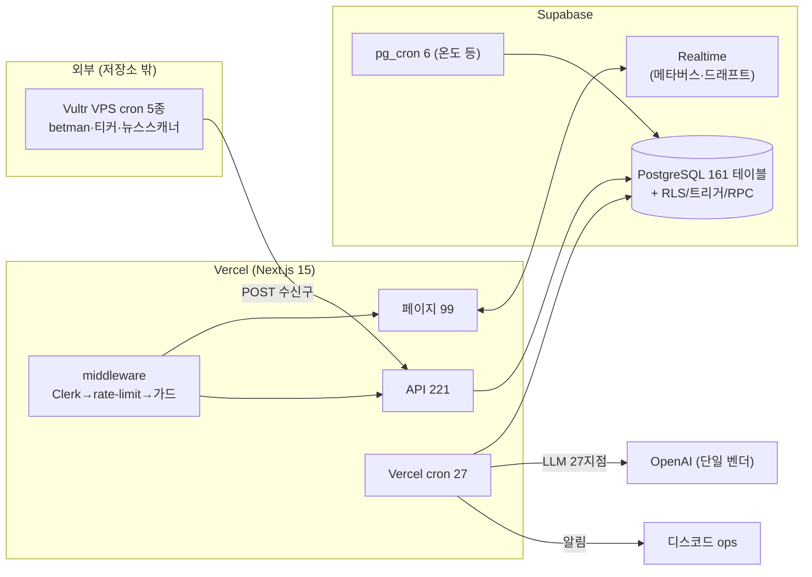
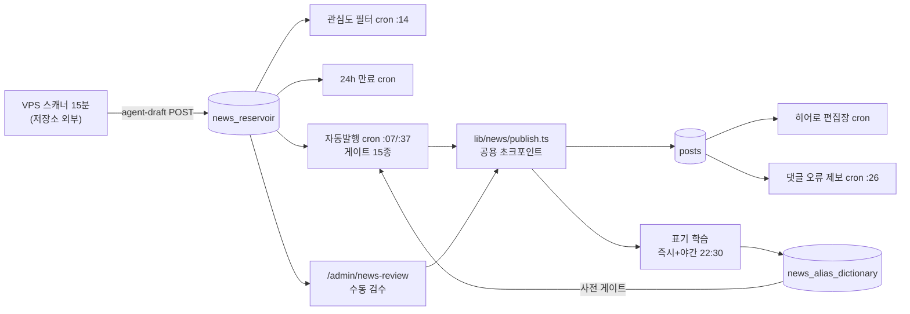
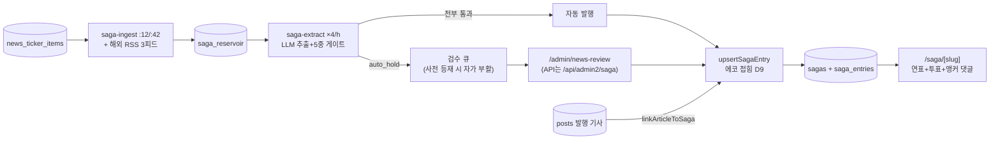
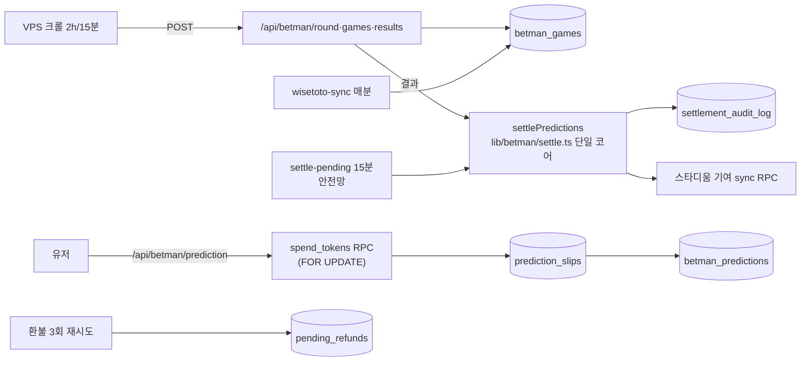
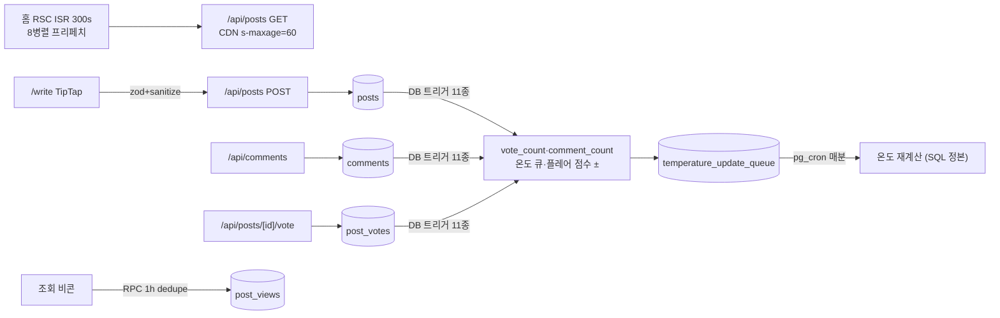
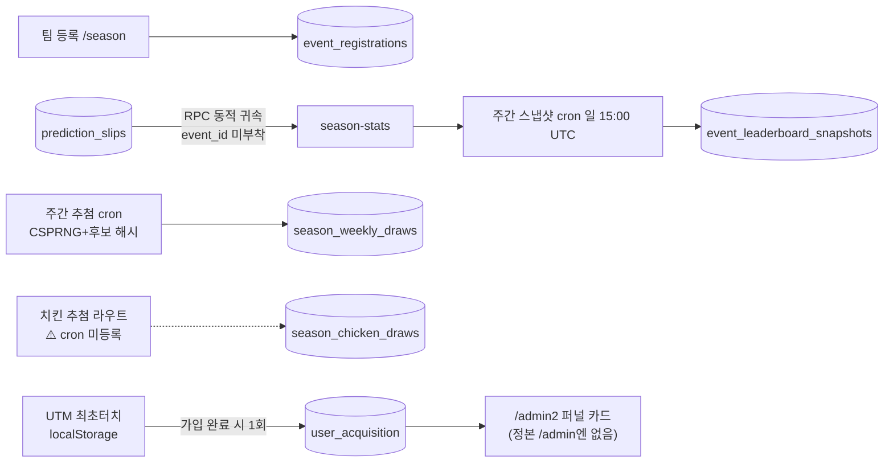
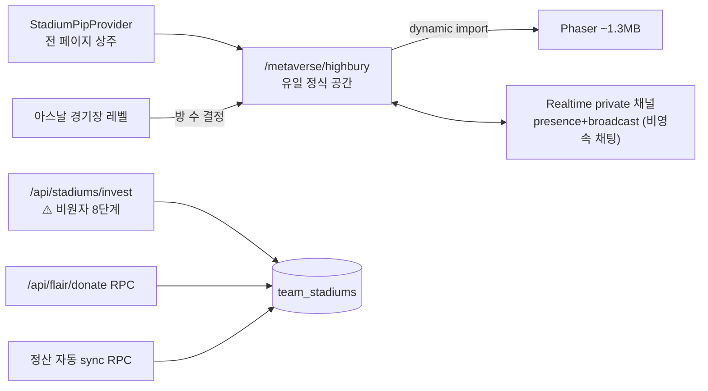
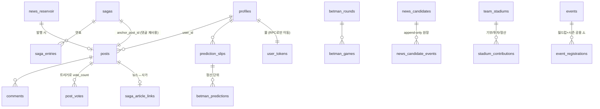

# gongnori.fan 아키텍처 지도

> 2026-08-08 전수 감사 산출물. 근거·상세는 `docs/audit/notes/*.md` (도메인별) 및 `docs/audit/_inventory.md` (전수 목록).
> 표기: ❓ = 미확인. 파일 경로는 전부 저장소 상대경로.

## 0. 한 장 요약

- 스포츠 커뮤니티 + 승부예측 + AI 뉴스룸. 인증은 Clerk, 데이터는 Supabase(RLS+트리거+RPC가 사실상 두 번째 백엔드).
- 자동화는 3층: Vercel cron 27 / pg_cron 6(DB에만 존재 — 리포 밖 정본) / VPS 상주 5종(한국 IP 필요·저장소 외부).
- 콘텐츠 생산은 LLM 파이프라인(뉴스 자동발행·사가 위키·히어로 편집장)이 담당, 사람은 검수 큐(`/admin/news-review`)에서 개입.
- 돈(볼/골드)은 SECURITY DEFINER RPC로만 이동, 정산 코어는 `lib/betman/settle.ts` 단일 (예외 1개 — HEALTH_REPORT P1-1).
- 감시는 withCronLog(1층) → ops-monitor·invariant-audit(2층, 상호 감시) → 디스코드로 수렴.

## 1. 도메인별 기능 구조

### 1-1. 뉴스 파이프라인 (상세: notes/news-pipeline.md)

- 게이트 15종(킬스위치→블로그→여자축구→이미지→중복→검사관 LLM→표기 사전→오피셜 네이버 대조…)은 notes/news-pipeline.md §3에 순서·라인 전수.
- 원장: `news_candidates` + `news_candidate_events`(append-only, RPC 경유 fail-open).
- 규율: 품질 실패=fail-closed(사람 검수), 인프라 실패=낙인 없이 재시도(retry_wait).

### 1-2. 사가 엔진 (상세: notes/saga.md)

- identity = `선수:방향:윈도우`(목적지 클럽 없음, D2). 문서당 앵커 post가 있어 댓글·알림·팬점수를 공짜로 재사용.
- 노출 스위치는 `is_confirmed` 하나(오피셜+done만 open, D7). 정산 없음(D15) — `saga_settlements`는 스키마만.

### 1-3. 베팅/정산/경제 (상세: notes/betting.md)

- 제출은 트랜잭션 없는 3단계 보상(compensating) 방식 — 위험 지점은 HEALTH_REPORT P1-2.
- 정산 멱등성: 전 상태 전이가 `.eq("status","pending")` 조건부 CAS. 적중=점수만(토큰 지급 없음).
- 일별 윈도우(08:00 경계·23:00 flip·볼 리셋)는 `lib/betman/daily-round.ts` + 마이그 20260630에 단일화.

### 1-4. 커뮤니티 코어 (상세: notes/community-core.md)

- 카운트·온도·플레어 점수는 **전부 DB 트리거**가 정본 — 앱 코드는 insert만 한다. (트리거 목록: notes/community-core.md §1c)
- 페칭 표준은 "RSC 프리페치 + 클라 SWR"이나 댓글·폴·알림은 수동 fetch로 이탈 (동 노트 §4 매트릭스).

### 1-5. 이벤트/성장 (상세: notes/events-growth.md)

- 월드컵(구)은 event_id 부착+`"live"` status, 시즌(현)은 동적 RPC 귀속 — 설계 2세대 공존. 월드컵 잔재·교차 오염은 HEALTH_REPORT P1-4.

### 1-6. 메타버스/스타디움 (상세: notes/metaverse-stadium.md)

- 격리 원칙("기존→메타버스 import 금지")은 PIP 전역 상주로 사실상 폐기 — Phaser 자체는 dynamic import라 초기 번들 안전.

### 1-7. 나머지 도메인 (한 줄 지도)

| 도메인 | 흐름 | 상세 |
|---|---|---|
| 게임 | 솔로 드래프트=순수 클라 상태머신(DB 무접촉) / 멀티=`draft_*` 4테이블+Realtime 신호→REST refetch / 미니게임 3종=iframe postMessage→`minigame_scores` | notes/games.md |
| 애그리게이터 | VPS CLI(scout→fetch→LLM 재작성)→`agg_reservoir`→자동승인·분산발행 cron→posts. **소스 6개 전부 disabled(휴면)**, cron은 no-op 공회전 | notes/aggregator-ticker.md |
| 티커/이적판 | VPS `data/crawlers/runner.js`가 `news_ticker_items` 유일 공급 → 게시판 티커·/transfer·사가 인제스트·ops-monitor 6곳 소비. /transfer는 티커 재분류(오피셜/유력/찌라시)만 | 〃 |
| 어드민 | `/admin` 30화면(requireAdmin) + `/admin2` 5화면(requireStaff — editor 유일 진입로). 검수 정본 화면이 `/api/admin2/*`에 의존. 무가드 admin 라우트 0 | notes/admin.md |
| 인증/보안 | clerkMiddleware→rate-limit→adminGuard(인증만)→onboardingGuard. role 판정은 레이아웃/라우트 단. service role 유출 0, cron 인증 33/33 | notes/auth-security.md |

## 2. 에이전트(LLM) 카탈로그

호출 지점 총 27개, 벤더 OpenAI 단일. 전수 표는 notes/llm-map.md. 핵심만:

| 에이전트 | 모델 | 트리거 | 실패 규율 | 볼륨 |
|---|---|---|---|---|
| 품질 검사관 (본문+이미지) | gpt-5.6-terra | news-auto-publish ×48/일 | fail-closed + infra 구분 | ≤96건/일, 단가 최고 |
| 표기 후보 제안→네이버 검증 | gpt-4o-mini | 미등재 선수명 발견 시 | 근거 없으면 등재 안 함 | ~13건/일 |
| 사가 추출 | gpt-4o-mini t=0 | saga-extract ×96/일, 20건 배치 1콜 | 배치 실패 null 격리 | 수십 콜/일 |
| 히어로 편집장 | gpt-4o | ×48/일 | 실패 시 기존 픽 유지+규칙 폴백 | 48콜/일 고정 |
| 관심도 필터 / 오류제보 판정 / 교정 학습 | 4o-mini·4.1-mini | 매시·일 1회 | 전부 "실패=유지/재시도" | 소량 |
| 어사인먼트 데스크 | 4o-mini | shadow 전용 (env) | dead_letter 멱등 | env에 따라 0~480/일 ❓ |
| VPS 스캐너 (초안 작성+VS 판정) | 4o-mini/4.1-mini | VPS 15분 cron | throw→run 로그 | **수백~2천콜/일 (최대 비용원)** |
| data/agents 뉴스룸 7종 | 4.1 계열 | 수동만 (cron 금지 정책) | chatWithRetry 백오프 | 요청 시 |

에이전트 간 체인(스캐너→검수→발행→사가/히어로/제보→학습→사전→게이트 순환)은 notes/llm-map.md §3 mermaid 2장.

## 3. 자동화 지도 (요약)

풀 표(27+6+5+1+1, 읽는/쓰는 테이블·실패 처리·실행 근거 포함)는 **notes/automation-map.md** — 여기는 층별 요약:

| 층 | 무엇 | 감시 |
|---|---|---|
| Vercel cron 27 | 뉴스 6·사가 3·베팅 4·커뮤글 2·이벤트 2·정리 3·감시 2·기타 — 전부 `verifyCronSecret`+`withCronLog` | cron_run_log → invariant-audit 심박 검사 |
| pg_cron 6 | 온도 4종 + betman 헬스 2종. **리포에 정의 없음(DB가 정본)** | 없음 — `cron.job_run_details` 직접 조회만 ⚠️ |
| VPS 5종 | betman 크롤 2·티커·뉴스스캐너·(wisetoto 스코어 ❓) | 산출물 신선도로 간접 감시 (ops-monitor) |
| Edge Function 1 | betman-sync-watchdog — **소스가 리포에 없음** ⚠️ | 없음 |
| GitHub Actions 1 | lint→tsc→test 래칫→build | GitHub 체크만 |

좀비/죽은 잡 판정(치킨 추첨 미등록 🔴, 주간 스냅샷 2종 좀비 의심 🔴, 고아 라우트 등)은 notes/automation-map.md §3·§5b — HEALTH_REPORT에 재수록.

## 4. 핵심 데이터 모델 (~15개)

| 테이블 | 역할 | 주의점 |
|---|---|---|
| posts | 만능 허브 — 일반 글·뉴스·사가 앵커·이벤트 발표 글 전부 | **63파일이 직접 쿼리** — 스키마 변경 폭발 반경 최대 |
| comments / post_votes | 트리거 11종이 카운트·온도·플레어 점수 파생 | 트리거가 정본 — 앱에서 카운트 갱신 금지 |
| prediction_slips + betman_predictions | 슬립(묶음)-예측(경기) 2계층, 정산·이벤트 귀속의 축 | idempotency_key unique, locked_odds 스냅샷 |
| user_tokens / user_gold (+_transactions) | 돈. RPC 내부에서만 쓰기 | 함수 재정의 시 REVOKE 재첨부 필수 |
| news_reservoir | 뉴스 초안 저수지 — status 전이가 곧 파이프라인 | jsonb 컬럼 다수(decision/draft/publish/audit) |
| news_alias_dictionary | 한국어 표기 정본 — 게이트·치환·학습이 전부 여기 수렴 | preferred_ko/surfaces/hangul_alts |
| sagas / saga_entries / saga_reservoir | 자동 위키 문서·연표·수집 큐 | identity_key·cluster_key 멱등 |
| news_candidates(+events) | 발행 판정 원장 (append-only) | 발행 제어는 안 함 — 관측용 |
| betman_games | 경기+마켓 (36k행, 마켓별 행 분리) | 전반전 중복행 등 함정은 docs/BETMAN_SYSTEM.md |
| event_registrations | 월드컵+시즌 공용 | **event_id 필터 필수** (누락 사고 有) |
| team_stadiums / stadium_contributions | 경기장 레벨·기여 | 기여 경로 3갈래 중 invest만 비원자 |
| invariant_findings / cron_run_log | 2층 감사 원장·크론 심박 | 알림은 open 전이 시 1회 |

## 5. 역색인 — "이거 고치려면 어디를 보나"

| 하고 싶은 일 | 보는 곳 |
|---|---|
| 뉴스 자동발행 게이트 추가/수정 | `app/api/cron/news-auto-publish/route.ts` (게이트 순서) + `lib/news/quality-gate.ts` |
| 발행 로직 (자동·수동 공통) | `lib/news/publish.ts` — 유일 초크포인트 |
| 선수 표기 문제 | `news_alias_dictionary` + `lib/news/naming-verify-loop.ts` + `/admin/news-review` 1클릭 등재 |
| 사가 문서 생성/단계 규칙 | `lib/saga/create.ts`(생성·동일인 가드), `stages.ts`(단계·노출), `publish.ts`(발행·에코) |
| 예측 제출 검증/차감 | `app/api/betman/prediction/route.ts` (745줄 — 검증 목록 §notes/betting 1-b) |
| 정산 규칙 | `lib/betman/settle.ts` 단일 (진입점 4개는 전부 여길 호출) |
| 볼/골드 규칙 | RPC 정의 = prod_schema.sql + 20260630 마이그. 호출부는 notes/betting.md §2 |
| 일별 회차 경계 (08:00/23:00) | `lib/betman/daily-round.ts` 만 |
| 피드/카드 렌더 | `components/post-card/post-card-content.tsx` (1,050줄 — 미디어 렌더러 내장) |
| 온도 | SQL RPC가 정본 (pg_cron), `lib/temperature.ts`는 표시용 fallback |
| 권한 | `lib/admin/roles.ts` (선언상 정본) — 단 `lib/supabase/admin.ts`·`require-admin-api.ts`에 중복 정의 존재 |
| rate-limit | `lib/rate-limit.ts` + `lib/middleware/rate-limit-guard.ts` (STRICT 목록) |
| CSP/보안 헤더/리라이트 | `next.config.mjs` (enforce·report-only 두 배열 모두 수정) |
| 크론 추가 | vercel.json 등록 + `verifyCronSecret` + `withCronLog` 3종 세트 (하나라도 빠지면 감시 사각) |
| 메타버스 방/채널 | `components/metaverse/highbury-stage.tsx` + `lib/metaverse/realtime/*` |
| 이벤트 추첨 | `lib/event/weekly-draw.ts` (순수 함수) + season-*-draw cron |
| 티커/이적판 분류 | `lib/transfer/feed.ts` (classifyTier — 오피셜/유력/찌라시 정본) |
| 디스코드 알림 | `lib/discord-notify.ts` (env 없으면 무음 no-op 주의) |
