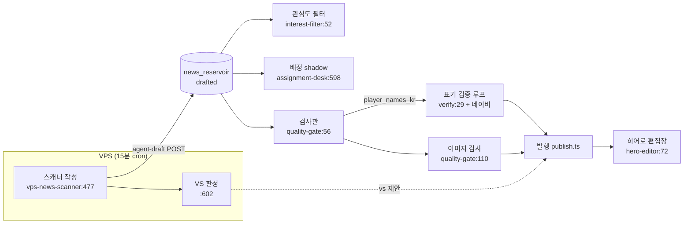
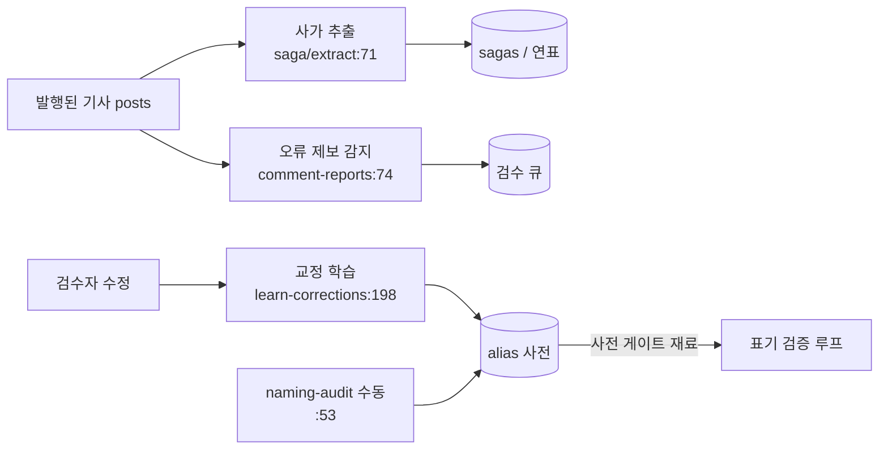

# LLM 호출 전수 조사 (아키텍처 감사 Phase 2)

작성: 2026-08-08. 근거는 전부 `상대경로:라인`. 벤더는 **OpenAI 단일** (Anthropic/Gemini 직접 호출 없음 — `data/agent-test`만 OpenAI 호환 엔드포인트로 gemini 기본값).

## 1. 호출 지점 전수

### 1-A. 메인 앱 — Vercel cron (배치형, 자동)

| 파일:라인 | 모델 | 용도 | 트리거 (cron) | 입력 | 출력 | 실패 처리 | 빈도 추정 |
|---|---|---|---|---|---|---|---|
| `lib/news/quality-gate.ts:56` `inspectDraft` | gpt-5.6-terra | 발행 전 품질 검사관 (번역누락/오타/제목-본문/수치모순 + 선수명 추출) | `news-auto-publish` 7,37분 (48회/일) → `app/api/cron/news-auto-publish/route.ts:457` | 제목+본문 4000자 | `{pass, reasons, player_names_kr}` | **fail-closed** (키없음·HTTP·타임아웃 전부 불통과→사람 검수) | 회당 페이싱 2건 → ~≤96/일 |
| `lib/news/quality-gate.ts:110` `inspectImage` | gpt-5.6-terra (vision) | 대표 이미지 적합성 (배너/광고 차단) | 같은 cron `route.ts:501,509` (재시도 1회 포함) | image_url detail:low | `{pass, reason}` | fail-closed + **infra 플래그** 구분 (HTTP 실패≠부적합, `quality-gate.ts:94-97`) | inspectDraft 통과 건수 × 1~2 |
| `lib/news/naming-verify-loop.ts:107` → `lib/naming/verify.ts:29` `proposeCandidates` | gpt-4o-mini t=0.3 | 미등재 선수 한글 표기 **후보** 제안 (채택은 네이버 검색량이 판정) | 같은 cron `route.ts:466` (미등재명 발견 시, 기사당 ≤8 `naming-verify-loop.ts:30`) | 이름+맥락 | `{romanized, candidates[≤4]}` | 빈값 반환 → 등재 안 함 (fail-closed), infra는 retry_wait | 미등재명 수 비례 — 24h 실측 13건/일 수준 |
| `lib/news/vs-issue.ts:51` `generateVsIssue` | gpt-4o-mini t=0.4 | VS 찬반 폴 + 3줄 요약 생성 | 발행 직후 `lib/news/publish.ts:315` 경유(주로 스캐너 제안 소비 `createVsPollFromDraft` — LLM 재호출은 폴백 경로) + `scripts/generate-vs-backfill.ts:53` | 제목+본문 2000자 | VsIssue 또는 null | null 격리, 절대 throw 안 함 | 발행량 이하 (폴백만) |
| `lib/saga/extract.ts:71` `extractTransferBatch` | gpt-4o-mini t=0 | 이적 기사 제목 → {선수·방향·클럽·단계} 20건 배치 1콜 | `saga-extract` 3,18,33,48분 (96회/일) `app/api/cron/saga-extract/route.ts:74` + `lib/saga/publish.ts:294` (단건) | 제목 목록 | items[] (번호 자기정렬 + 클럽 증거검사) | 배치 실패 전부 null (격리) | ~수십 콜/일 (신규 티커 유입량 의존) |
| `app/api/cron/hero-editor/route.ts:72` | **gpt-4o** t=0.3 | 메인 히어로 3장 편집장 선정 (+이유 기록) | `hero-editor` 22,52분 | 24h 후보 ≤25건 목록 | `{picks:[{id,reason}]×3}` | 실패 시 기존 픽 유지 + 규칙 폴백 (`route.ts:110`) | **48콜/일 고정** |
| `app/api/cron/news-interest-filter/route.ts:52` | gpt-4o-mini t=0 | 검수 큐 관심도 심사 (무관심 기사만 반려) | `news-interest-filter` 매시 :14 | 제목 ≤25건 배치 | `{items:[{i,keep,reason}]}` | null=유지 (반려 안 하는 방향의 fail-safe) | ~24-48콜/일 |
| `lib/news/comment-reports.ts:74` `classifyErrorReports` | gpt-4.1-mini t=0 | 댓글이 기사 오류 **제보**인지 판정 (룰필터 `:18` 통과분만, ≤20건 1콜) | `news-comment-reports` 매시 :26 → `route.ts:101` | 기사제목·발췌·댓글 | `{results:[{idx,is_report,claim}]}` | null 반환 → 다음 회차 재시도 | ≤24콜/일 (후보 있을 때만) |
| `lib/news/learn-corrections.ts:198` `learnFromDeskEdit` | gpt-4.1-mini t=0 | 발행원본↔수정본 diff → 표기교정/사실정정 분리 추출 | `news-learn-edits` 일 1회 22:30 KST (`route.ts:123`) + 아래 온디맨드 3곳 | 원본·수정본 텍스트 | corrections/factual | empty 반환 + **환각 가드**(`:243` 실재 문자열만 등재) | 수정 기사 수/일 (한 자릿수) |
| `lib/news/assignment-desk.ts:598` `requestAssignment` | gpt-4o-mini (t=0, gpt-5계열이면 자동 생략 `:324`) | 어사인먼트 데스크 **shadow 전용** 판정 | `news-assignment-desk` 매시 :19 — env `NEWS_ASSIGNMENT_DESK=shadow` 아니면 **0콜** (`route.ts:31-35`), 회당 ≤20 | 제목+본문 2500자 | verdict + usage/latency 계측 | 실패도 계측 담아 반환, dead_letter 멱등 (재호출 금지) | 켜져 있으면 ≤480콜/일 ❓env 상태 |
| `lib/soccerway/team-search.ts:106` `proposeSearchQueries` | gpt-4o-mini t=0 | 한글 팀명 → 영문 검색어 후보 (soccerway 매핑) | `match-mapping-shadow` 매시 :41 → `lib/soccerway/match-mapping.ts:361` (unresolved 팀만) | 팀명+리그 | `{queries[≤3]}` | 빈 배열 (기존 team_unresolved 경로) | 미해결 팀 수 비례 — 소량 |

### 1-B. 메인 앱 — 온디맨드 (요청 시)

| 파일:라인 | 모델 | 용도 | 트리거 | 실패 처리 |
|---|---|---|---|---|
| `app/api/og/route.ts:233` | gpt-4o-mini t=0.3 | /write 소스 URL 기사 5줄 한국어 요약 | 유저가 글쓰기에서 URL 붙일 때 (`hooks/use-write-og.ts`) | null, 8s 타임아웃 |
| `lib/admin/insight.ts:140` | **gpt-4.1** (env `ADMIN_INSIGHT_MODEL`, `insight.ts:20`) t=0.3 | 운영 지표 → 인사이트/액션 제안 | GET `/api/admin2/insight` (`route.ts:39`, 어드민 열람) | null — 화면 안 죽음 |
| `lib/news/learn-corrections.ts:198` (재사용) | gpt-4.1-mini | 검수 발행 시 즉시 학습 | `app/api/admin/news-review/route.ts:123`, `app/api/admin/published-fixes/route.ts:241,303`, `lib/news/publish.ts:324` | empty |

### 1-C. 수동 라우트 / 수동 스크립트 (`pnpm exec tsx`)

| 파일:라인 | 모델 | 용도 | 트리거 | 실패 처리 |
|---|---|---|---|---|
| `app/api/cron/naming-audit/route.ts:53` `extractNames` | gpt-4o-mini t=0 | 발행 기사 선수명 추출 → `verifySpelling` 소급 교정 | **수동** (vercel.json 미등록, `route.ts:14` 주석) — 이름당 `verify.ts:29` 추가 호출 | 빈 배열, dry=1 지원 |
| `app/api/cron/reddit-seed-posts/route.ts:150` | **gpt-4o** t=0.8 | 레딧 인기글 → 한국어 커뮤글 생성 | **cron 미등록 (중단)** — 수동 호출만 | null. ⚠ timeout signal 없음 (`:150-166`) |
| `scripts/saga-backfill-dryrun.ts:60` | (extract.ts 재사용) gpt-4o-mini | 사가 백필 드라이런 (300건=15콜) | 수동 | 배치 null |
| `scripts/_backfill-saga-player-names.ts:72` | (verify.ts 재사용) gpt-4o-mini | 사가 선수명 백필 | 수동 | fail-closed |
| `scripts/generate-vs-backfill.ts:53` | (vs-issue.ts 재사용) | VS 폴 백필 | 수동 | null |
| `scripts/generate-season-assets.mjs:120` | `IMAGE_MODEL` 기본 **"gpt-image-2"** (`:26`) | 시즌 이벤트 이미지 생성 (images/generations) | 수동 1회성 | throw |
| `scripts/news-scanner.mjs:212` | `SCANNER_MODEL` 기본 gpt-4o-mini t=0.4 | VPS 스캐너의 **구버전 로컬 사본** | 수동/폐기 대기 ❓ | throw |

### 1-D. VPS (Vultr, 저장소 외부에서 실행 — 코드는 저장소에)

| 파일:라인 | 모델 | 용도 | 트리거 | 실패 처리 |
|---|---|---|---|---|
| `scripts/vps-news-scanner/news-scanner.mjs:477` | `SCANNER_MODEL` 기본 gpt-4o-mini / 원문 있으면 `SCANNER_MODEL_LONG` 기본 gpt-4.1-mini (`:29,32`) t=0.4 | 레딧 글+기사원문/트윗 → 한국어 초안 작성 (worthy 판정 겸용) | **Vultr cron 15분** (`:16,47` — run당 레딧 요청 12건 예산) | throw → run 로그 (개별 글 격리 ❓호출부) |
| `scripts/vps-news-scanner/news-scanner.mjs:602` `judgeVsIssue` | 위와 동일 MODEL t=0.3 | 초안의 VS 쟁점 2단 판정+생성 (confidence<0.4 컷) | 초안 작성 성공 건마다 | null |
| `data/crawlers/core/summarizer.js:205,309` | **gpt-5.1** t=0.3 | 네이버뉴스/레딧 티커 배치 요약 (legacy 크롤러) | Vultr cron — 단 **소스 0개 휴면** (2026-08-03 결정) | throw, `chatWithRetry` 429/5xx 백오프 2회 (`data/crawlers/core/openai-client.js:27`) |

### 1-E. `data/agents/` — 수동 배치 (운영 정책상 cron 금지, 요청 시만 실행)

| 파일:라인 | 모델 (tier) | 용도 |
|---|---|---|
| `data/agents/scripts/filter-credibility-run.js:98` | T1 = gpt-4.1-mini | 신뢰도 필터 |
| `data/agents/scripts/desk-review-run.js:106` | T2 = gpt-4.1 (`:170`) | 데스크 리뷰 |
| `data/agents/scripts/write-run.js:210` | T3 = gpt-4.1 (`:296`) t=0.3 | 한국어 기사 작성 |
| `data/agents/scripts/seo-format-run.js:154` | tier 설정값 | SEO 포맷 |
| `data/agents/scripts/preview-publish-run.js:77` | `PREVIEW_MODEL` 기본 gpt-4.1-mini (`:32`) | 경기 프리뷰 발행 |
| `data/agents/scripts/learn-from-edits.js:253` | gpt-4.1-mini (`:33`) | 교정 학습 — **Vercel cron `news-learn-edits`로 대체됨** (중복, §6) |
| `data/agents/scripts/agg-write-run.js:105` → `core/agg-gen.js:175` | T1 gpt-4.1-mini t=0.85 (`agg-gen.js:19,178`) | 커뮤 애그리게이터 재작성 — **휴면** |

tier 정의: `data/agents/config/model-tiers.json` (T1=gpt-4.1-mini, T2/T3=gpt-4.1). 전부 `data/crawlers/core/openai-client.js:27` `chatWithRetry` 공유(429/5xx 지수백오프).

### 1-F. `data/agent-test/` — 실험용 (프로덕션 아님)

`runner.js:91`, `generate-content.js:52`, `gen.js:30`, `gen2.mjs:33`, `gen-comments.mjs:33` — `LLM_BASE_URL` 가변(OpenAI 호환), 기본 모델 `gemini-2.0-flash` (`generate-content.js:13`). `runner.js:155`의 `temperature: 36.5`는 profiles 컬럼(유저 온도)이지 API 파라미터 아님.

## 2. 프롬프트 위치 카탈로그

**인라인 상수 (TS/JS 소스 안)**: `lib/news/quality-gate.ts:21`, `lib/news/quality-gate.ts:119`(이미지, 인라인), `lib/news/assignment-desk.ts:252`, `lib/news/comment-reports.ts:42`, `lib/news/learn-corrections.ts:19`, `lib/news/vs-issue.ts:29`, `lib/saga/extract.ts:38`, `lib/naming/verify.ts:39`, `lib/soccerway/team-search.ts:117`, `lib/admin/insight.ts:39`, `app/api/cron/hero-editor/route.ts:82`, `app/api/cron/news-interest-filter/route.ts:31`, `app/api/cron/naming-audit/route.ts:64`, `app/api/cron/reddit-seed-posts/route.ts:131`, `app/api/og/route.ts:243`, `scripts/vps-news-scanner/news-scanner.mjs:~450(sys)+579(VS)`, `scripts/news-scanner.mjs:~197`, `data/crawlers/core/summarizer.js:~190,~295`.

**프롬프트 파일 (.md)**: `data/agents/prompts/` — agg-rewriter.md, credibility-filter.md, desk-reviewer.md, korean-naming-resolver.md, seo-formatter.md, summary-writer.md.

## 3. 에이전트 체인

## 4. 상주형/배치형 구분

| 구분 | 지점 |
|---|---|
| **웹앱 Vercel cron** | quality-gate(×2)·naming-verify-loop·vs-issue·saga-extract·hero-editor·interest-filter·comment-reports·learn-corrections·assignment-desk(shadow)·team-search — §1-A |
| **웹앱 온디맨드** | og 요약, admin2 insight, 검수 발행 시 learn-corrections — §1-B |
| **VPS (저장소 외부 cron)** | vps-news-scanner (15분), crawlers summarizer (휴면) — §1-D |
| **수동 스크립트/라우트** | naming-audit, reddit-seed-posts(중단), saga/vs/선수명 백필, season-assets, data/agents 전체(cron 금지 정책) — §1-C/E |
| **상주형(데몬)** | 없음 — 전부 요청-응답형 |

## 5. 비용 관점 — 시간당/일당 호출 상위

| 순위 | 지점 | 추정 | 근거 |
|---|---|---|---|
| 1 | VPS 스캐너 작성+VS (`vps-news-scanner:477,602`) | run당 ~5-25콜 × 96run = **수백~2천콜/일** (mini/4.1-mini) | 15분 cron, 레딧 12건/run 예산 |
| 2 | 배정 shadow (`assignment-desk:598`) | **켜져 있으면 ≤480콜/일** | 매시 ≤20건. env로 0이 될 수 있음 ❓ |
| 3 | 자동발행 게이트 묶음 (`quality-gate:56,110` + `verify:29`) | ~100-300콜/일, 단 **terra(고급 모델)라 단가 최고** | 48run × 페이싱 2건 × (검사+이미지+표기 n회) |
| 4 | saga-extract (`extract.ts:71`) | 96run/일, 유입 있을 때만 — 수십 콜 | 20건 배치 1콜로 압축 |
| 5 | hero-editor (`route.ts:72`) | 48콜/일 고정, **gpt-4o** | 30분 주기 무조건 1콜 (후보 없으면 스킵) |

계측 인프라: assignment-desk만 usage/비용 추정 내장 (`assignment-desk.ts:539-556`). 나머지는 토큰 계측 없음.

## 6. 특이사항

1. **gpt-5.1 + temperature=0.3 → 400 위험**: `data/crawlers/core/summarizer.js:205-215, 309-318`이 gpt-5.1에 `temperature: 0.3`을 보냄. 운영 메모·코드 주석(`quality-gate.ts:61` "GPT-5 계열은 temperature 미지원 — 넣으면 400") 및 `assignment-desk.ts:324-326` `supportsTemperature` 가드와 정면 모순. 현재 소스 0개 휴면이라 안 터질 뿐, 재가동 시 전건 400.
2. **temperature 가드가 한 곳에만 있음**: `assignment-desk.ts:324`의 `/^gpt-5/i` 가드는 그 모듈 전용. 다른 15개 지점은 모델 하드코딩이라 모델만 5세대로 바꾸면 즉사하는 구조 (quality-gate는 아예 temperature를 안 보내는 방식으로 회피).
3. **VS 쟁점 프롬프트 중복 3벌**: `lib/news/vs-issue.ts:29`(폴백 생성) vs `scripts/vps-news-scanner/news-scanner.mjs:579`(2단 판정, confidence 게이트 있음 — 더 정교) vs 구사본 `scripts/news-scanner.mjs`. 기준이 두 개라 드리프트 중.
4. **스캐너 사본 2벌**: `scripts/news-scanner.mjs`(212)와 `scripts/vps-news-scanner/news-scanner.mjs`(477) — 후자가 정본(원문 공급·MODEL_LONG 있음). 전자는 폐기 대상 ❓.
5. **교정 학습 경로 2벌**: `lib/news/learn-corrections.ts`(Vercel cron, 정본) vs `data/agents/scripts/learn-from-edits.js`(구 Hermes 로컬 경로). 프롬프트·등재 로직이 따로 진화할 수 있음.
6. **모델 하드코딩 불일치**: 같은 "한 급 위" 용도인데 hero-editor는 gpt-4o(`route.ts:76`), 검사관은 gpt-5.6-terra(`quality-gate.ts:62`), admin insight는 gpt-4.1(`insight.ts:20`). env 오버라이드 가능한 곳은 insight·스캐너·프리뷰·이미지뿐.
7. **reddit-seed-posts만 타임아웃 없음**: `route.ts:150-166`에 `AbortSignal.timeout` 부재 (다른 전 지점은 8~90s 설정). cron 미등록 상태라 실위험 낮음.
8. `scripts/generate-season-assets.mjs:26` 기본값 `"gpt-image-2"` — 실존 모델명인지 검증 필요 ❓ (env `IMAGE_MODEL`로 덮어쓰는 전제로 보임).
9. 요약 프롬프트 중복: `app/api/og/route.ts:243`(5줄 요약)과 `data/crawlers/core/summarizer.js`(3줄 요약)·`data/agents/prompts/summary-writer.md` — 용도 유사하나 3곳 별도 관리.
